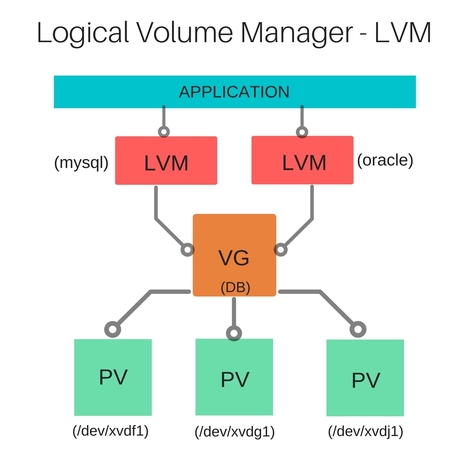

# LVM (Logical Volume Management) Operations Guide

[](https://devopsideas.com/working-logical-volume-manager-lvm/)

For a detailed walkthrough of LVM concepts and operations, refer to the following resource:

[Working with Logical Volume Manager (LVM)](https://devopsideas.com/working-logical-volume-manager-lvm/)

## Overview
This guide demonstrates two approaches to managing EBS volumes on AWS EC2 instances:
1. Using LVM (Logical Volume Management)
2. Direct Volume Mounting

## LVM Approach

## Prerequisites
- AWS EC2 instance with attached EBS volumes
- Root or sudo privileges
- Available EBS volumes (e.g., /dev/xvdd, /dev/xvde, /dev/xvdf)

## Step-by-Step Guide

### 1. Attach EBS Volumes
Ensure your desired EBS volumes are properly attached to your AWS EC2 instance:
- /dev/xvdd
- /dev/xvde
- /dev/xvdf

### 2. Initialize Physical Volumes (PVs)
```bash
sudo pvcreate /dev/xvdd /dev/xvde /dev/xvdf
```

### 3. Create Volume Group (VG)
```bash
# Syntax
sudo vgcreate <vg_name> /dev/<pv_device1> /dev/<pv_device2>

# Example
sudo vgcreate tws_vg /dev/xvdd /dev/xvde
```

### 4. Create Logical Volume (LV)
```bash
# Syntax
sudo lvcreate -L <size> -n <lv_name> <vg_name>

# Example
sudo lvcreate -L 10G -n tws_lv tws_vg
```

### 5. Create File System
```bash
# Syntax
sudo mkfs.ext4 /dev/<vg_name>/<lv_name>

# Example
sudo mkfs.ext4 /dev/tws_vg/tws_lv
```

### 6. Create Mount Point
```bash
# Syntax
sudo mkdir /mnt/<mount_point_name>

# Example
sudo mkdir /mnt/tws_lv_mount
```

### 7. Mount Logical Volume
```bash
# Syntax
sudo mount /dev/<vg_name>/<lv_name> /mnt/<mount_point_name>

# Example
sudo mount /dev/tws_vg/tws_lv /mnt/tws_lv_mount
```

## Persistent Mount Configuration
To ensure the logical volume is mounted automatically during system boot, update `/etc/fstab`:

```bash
# Add the following line to /etc/fstab
/dev/tws_vg/tws_lv /mnt/tws_lv_mount ext4 defaults 0 0
```

## Direct Volume Mounting

### Steps for Direct Mount

1. **Create Mount Point**
```bash
sudo mkdir /mnt/<mount_point_name>
# Example: sudo mkdir /mnt/tws_disk_mnt
```

2. **Format Volume**
```bash
sudo mkfs -t ext4 /dev/<device_path>
# Example: sudo mkfs -t ext4 /dev/xvdf
```

3. **Mount Volume**
```bash
sudo mount /dev/<device_path> /mnt/<mount_point_name>/
# Example: sudo mount /dev/xvdf /mnt/tws_disk_mnt/
```

## Verification Commands
- `pvs`: Display physical volume information
- `vgs`: Display volume group information
- `lvs`: Display logical volume information
- `df -h`: Show mounted filesystems
- `lsblk`: List block devices

## Important Notes
1. Always backup important data before performing LVM operations
2. Verify device names before executing commands
3. Double-check mount points and filesystem types
4. Test mount configuration before system reboot

## Best Practices
1. Use descriptive names for volume groups and logical volumes
2. Document your LVM configuration
3. Monitor storage usage regularly
4. Keep some free space in volume groups for future expansion

## Dynamic LVM Operations

### 1. Extend Volume Group
```bash
# Add a new Physical Volume to existing Volume Group
sudo vgextend tws_vg /dev/xvdf
```

### 2. Verify Volume Group Size
```bash
# Check VSize and VFree
sudo vgs
```

### 3. Extend Logical Volume
```bash
# Increase LV size by 2GB
sudo lvextend -L +2G /dev/tws_vg/tws_lv

# Or use all remaining free space
sudo lvextend -l +100%FREE /dev/tws_vg/tws_lv
```

### 4. Resize Filesystem
```bash
# Resize ext4 filesystem without unmounting
sudo resize2fs /dev/tws_vg/tws_lv
```

### 5. Verify New Size
```bash
# Check mounted filesystem size
df -h /mnt/tws_lv_mount
```

## Important Notes

1. **Persistence**: Update `/etc/fstab` for automatic mounting on system boot
2. **LVM vs Direct Mount**:
   - LVM offers flexibility for resizing and management
   - Direct mounting is simpler but less flexible
3. **Safety**: Always backup data before storage operations
4. **Permissions**: Most commands require root/sudo access
5. **Dynamic Management**: LVM allows online storage expansion without downtime